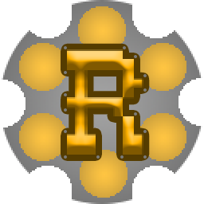
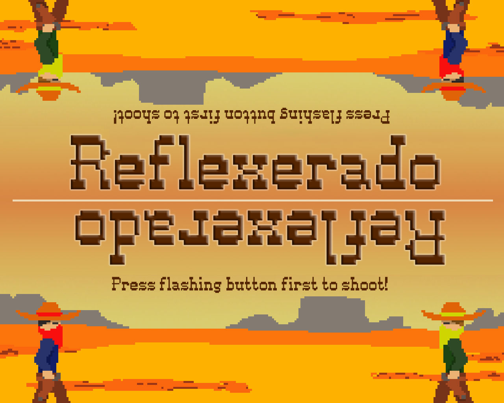
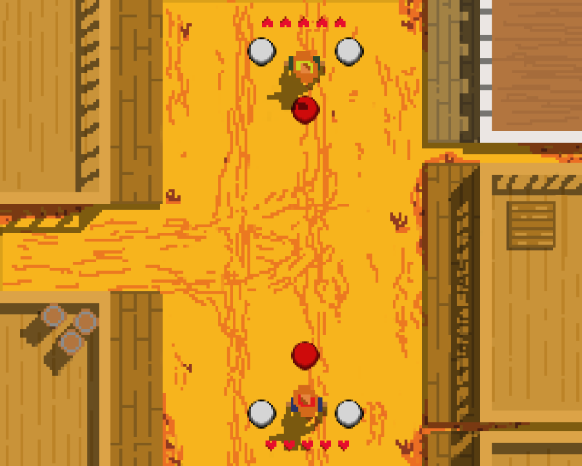

&nbsp;Reflexerado
======

Originally created as Webgame for [Kuti Arcade Console](http://kuti-arcade.com/).
Later on ported to Unity3D, but this is one is the true original.

Phaser2D Javascript Game Engine, Pixel-Art style, simple but thrilling game mechanic.

#### Quick Fingers Required!

One-on-one western duel at high noon. You don't need to bring anything else than quick reactions.

The game is available [here](http://kaufi07.bplaced.net/reflexerado/).

Pull the trigger faster than your opponent!
  
&nbsp;&nbsp;

### Instructions
Press/Click the flashing button first. That's it.
Consider rotating your screen.

### Controls

Player One (lower side, red player)
left button: Q; middle button: S; right button: Y;
Player Two (upper side, yellow player)
left button: M; middle button: J; right button: I;

Z to mute.

#### Credits

Art created by Fabio Strenger ([@Theledin](https://twitter.com/Theledin))